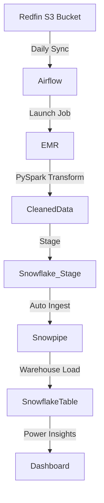

# 🏠 redfin-real-estate-pipeline

Real estate data pipeline using Apache Airflow, Amazon EMR and Snowflake. Auto-ingestion using Snowpipe and insightful dashboard for 5M+ listings from Redfin S3 data.

---

## 🖼️ Gallery – Quick Preview
**Dashboard**  


**Airflow DAG**  


**S3 Bucket Event Alert**  


**EC2 Instance**  


**EMR Cluster**  


**EMR Cluster Steps**  


**Steps in EMR Cluster**  


**Snowflake Snowpipe Auto-Ingest**  


---

## 🛠️ Project Overview

This project fetches real estate data from **Redfin’s public S3 bucket**, transforms it using **Apache Spark on EMR**, and loads it into **Snowflake** with **Snowpipe** for auto-ingestion. The final output powers a rich dashboard for city, state, and property-type-based analytics.

---

## 🧰 Tech Stack

- **Redfin S3 Data** – Source listings (5M+ entries)
- **Apache Airflow** – Pipeline orchestration
- **Amazon EMR + PySpark** – Data transformation
- **Snowflake** – Data warehouse
- **Snowpipe** – Automated data loading
- **Power BI / Tableau** – Dashboard visualization

---

## 📡 Architecture



---

## 🚀 Setup Guide

### 1. Clone the Repository

```bash
git clone https://github.com/yourusername/redfin-real-estate-pipeline.git
cd redfin-real-estate-pipeline
```

### 2. Install and Configure

#### ✅ Provisioning Environment (from `commands.txt`)

```bash
python3 --version
sudo apt update
sudo apt install python3-pip
sudo apt install python3.10-venv
python3 -m venv redfin_venv
source redfin_venv/bin/activate
pip install boto3
pip install --upgrade awscli
aws configure
pip install apache-airflow
pip install apache-airflow-providers-amazon
airflow standalone
```

#### ✅ Setup EMR Roles

```bash
aws iam list-roles | grep 'EMR_DefaultRole\|EMR_EC2_DefaultRole'
aws emr create-default-roles
```

---

## 📂 Ingestion Script (`ingest.sh`)

```bash
wget -O - https://redfin-public-data.s3.us-west-2.amazonaws.com/redfin_market_tracker/city_market_tracker.tsv000.gz | aws s3 cp - s3://redfin-data-project-yml-tanya/store-raw-data-yml/city_market_tracker.tsv000.gz
```

---

## 🔁 Airflow DAG (`redfin_analytics.py`)

```python
with DAG('redfin_analytics_spark_job_dag', ...) as dag:

    start_pipeline = DummyOperator(task_id="tsk_start_pipeline")
    create_emr_cluster = EmrCreateJobFlowOperator(task_id="tsk_create_emr_cluster", job_flow_overrides=job_flow_overrides)
    is_emr_cluster_created = EmrJobFlowSensor(...)
    add_extraction_step = EmrAddStepsOperator(task_id="tsk_add_extraction_step", steps=SPARK_STEPS_EXTRACTION)
    is_extraction_completed = EmrStepSensor(...)
    add_transformation_step = EmrAddStepsOperator(task_id="tsk_add_transformation_step", steps=SPARK_STEPS_TRANSFORMATION)
    is_transformation_completed = EmrStepSensor(...)
    remove_cluster = EmrTerminateJobFlowOperator(...)
    is_emr_cluster_terminated = EmrJobFlowSensor(...)
    end_pipeline = DummyOperator(task_id="tsk_end_pipeline")

    start_pipeline >> create_emr_cluster >> is_emr_cluster_created >> add_extraction_step >> is_extraction_completed
    is_extraction_completed >> add_transformation_step >> is_transformation_completed >> remove_cluster
    remove_cluster >> is_emr_cluster_terminated >> end_pipeline
```

---

## 🔄 Transformation Job (`transform_redfin_data.py`)

```python
def transform_date():
    redfin_data = spark.read.csv("s3://.../city_market_tracker.tsv000.gz", header=True, inferSchema=True, sep="\t")
    df_redfin = redfin_data.select([...]).na.drop()
    df_redfin = df_redfin.withColumn("period_end_yr", year("period_end"))
    df_redfin = df_redfin.withColumn("period_end_month", month("period_end")).drop("period_end", "last_updated")
    df_redfin = df_redfin.withColumn("period_end_month", when(...))  # month to name
    df_redfin.write.mode("overwrite").parquet("s3://.../redfin_data.parquet")
```

---

## ❄️ Snowflake Configuration (`snowflake.txt`)

### Create Table

```sql
CREATE OR REPLACE TABLE redfin_database_1.redfin_schema.redfin_table (
    city STRING,
    homes_sold INT,
    ...
    state STRING
);
```

### Create Stage + File Format

```sql
CREATE OR REPLACE file format redfin_database_1.file_format_schema.format_parquet
    type = 'PARQUET';

CREATE OR REPLACE STAGE redfin_database_1.external_stage_schema.redfin_data_project_yml_tanya 
    url='s3://redfin-data-project-yml-tanya/...'
    credentials=(aws_key_id='xxx' aws_secret_key='xxx')
    FILE_FORMAT = redfin_database_1.file_format_schema.format_parquet;
```

### Snowpipe Setup

```sql
CREATE OR REPLACE PIPE redfin_database_1.snowpipe_schema.redfin_snowpipe
AUTO_INGEST = TRUE
AS 
COPY INTO redfin_database_1.redfin_schema.redfin_table
FROM (
    SELECT $1:city, $1:homes_sold, ..., $1:state
    FROM @redfin_database_1.external_stage_schema.redfin_data_project_yml_tanya
);
```

---

## ✅ Validation Queries

```sql
SELECT * FROM redfin_database_1.redfin_schema.redfin_table LIMIT 1000;
SELECT COUNT(*) FROM redfin_database_1.redfin_schema.redfin_table;
```
