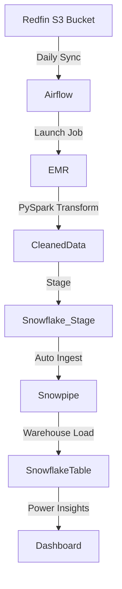

# 🏠 redfin-real-estate-pipeline

Real estate data pipeline using Apache Airflow, Amazon EMR and Snowflake. Auto-ingestion using Snowpipe and insightful dashboard for 5M+ listings from Redfin S3 data.

---

## 🖼️ Gallery – Quick Preview
**Dashboard**  


**Airflow DAG:**  


**EMR Cluster:**  


**Snowflake Table:**  


**S3 Bucket:**  


---

## 🛠️ Project Overview

This project fetches real estate data from **Redfin’s public S3 bucket**, transforms it using **Apache Spark on EMR**, and loads it into **Snowflake** with **Snowpipe** for auto-ingestion. The final output powers a rich dashboard for city, state, and property-type-based analytics.

---

## 🧰 Tech Stack

- **Redfin S3 Data** – Source listings (5M+ entries)
- **Apache Airflow** – Pipeline orchestration
- **Amazon EMR + PySpark** – Data transformation
- **Snowflake** – Data warehouse
- **Snowpipe** – Automated data loading
- **Power BI / Tableau** – Dashboard visualization

---

## 📡 Architecture



---

## 🚀 Setup Guide

### 1. Clone the Repository

```bash
git clone https://github.com/yourusername/redfin-real-estate-pipeline.git
cd redfin-real-estate-pipeline
```

### 2. Set Environment Variables

Create a `.env` file:

```env
AWS_ACCESS_KEY_ID=your_aws_key
AWS_SECRET_ACCESS_KEY=your_aws_secret
SNOWFLAKE_USER=your_username
SNOWFLAKE_PASSWORD=your_password
SNOWFLAKE_ACCOUNT=your_account
```

---

## ⛅ Airflow DAG Sample

```python
from airflow import DAG
from airflow.providers.amazon.aws.operators.emr import EmrAddStepsOperator
# DAG sample continues...
```
